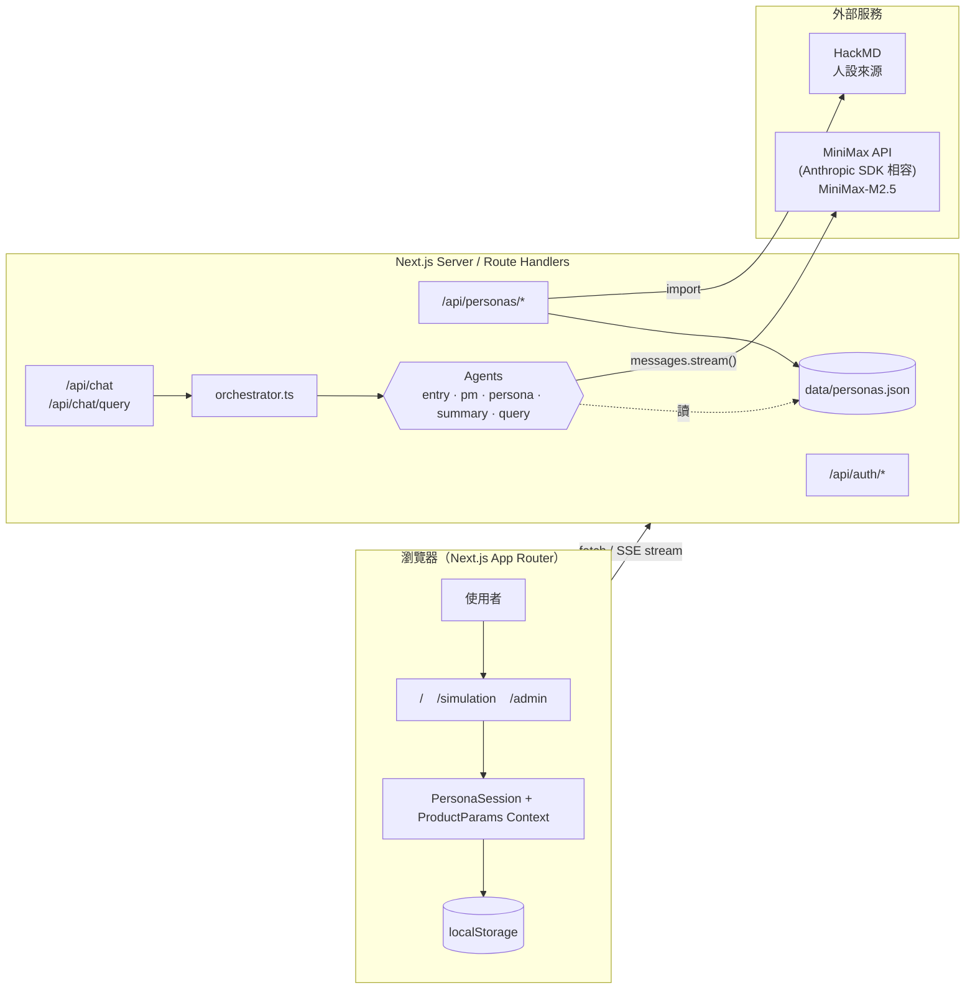
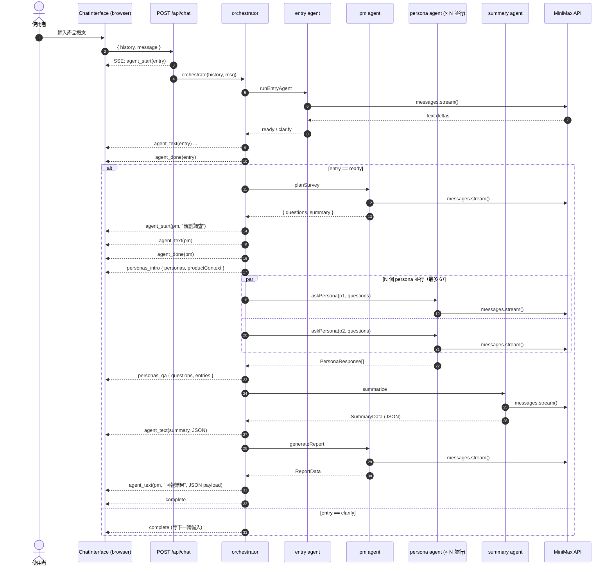
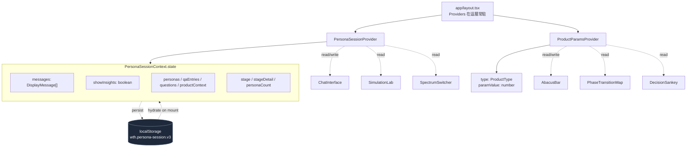
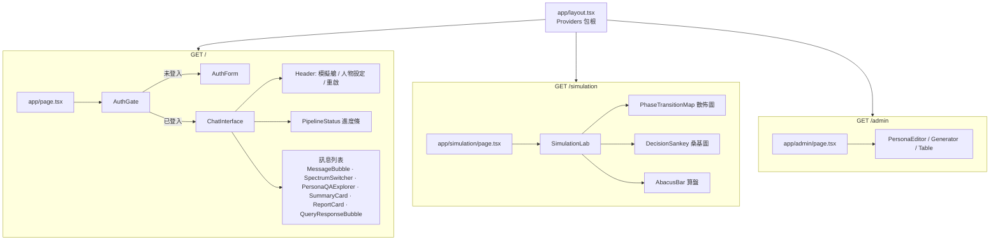
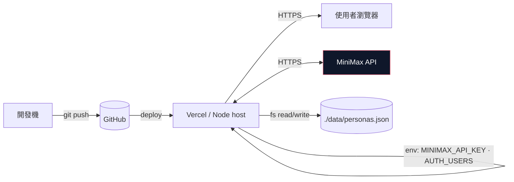
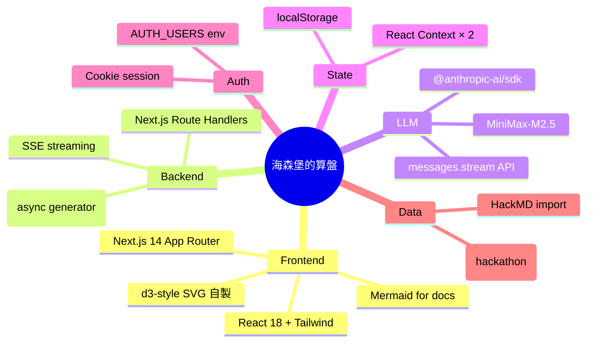

# 海森堡的算盤 · 系統架構說明

> 給 hackathon 評審 / 內部測試使用。所有圖以 Mermaid 撰寫，GitHub 與 VSCode preview 直接渲染。

---

## 0. 一句話總覽

> 一個 **multi-agent 虛擬受訪者市調平台** — 使用者輸入產品概念，後端起 5 顆 LLM agent (entry → pm → persona × N → summary → pm-report) 並行訪談 10+ 位虛擬人設，產出量化散佈圖、桑基決策流向圖、與結構化洞察報告。

---

## 1. 系統架構（高層）

**關鍵設計點**

| 元件 | 技術 | 為什麼 |
|---|---|---|
| Next.js 14 App Router | React 18 + RSC | 客戶端多頁 + server-side streaming SSE 一站搞定 |
| MiniMax API（走 Anthropic SDK）| `@anthropic-ai/sdk` `baseURL=https://api.minimax.io/anthropic` | 直接相容 SDK、token 計價友善 |
| Persona JSON file store | `data/personas.json` | Hackathon 簡化：免 DB，admin UI 直接讀寫 |
| localStorage 持久化 | `wth.persona-session.v3` | 跨路由 + 重整保留 chat、stage、personas、qaEntries |
| Cookie session auth | `lib/auth.ts` | 帳密寫在 `AUTH_USERS` env，避免 hardcode |

---

## 2. Multi-agent 序列圖

> 「跑一次完整訪談」的時間順序，含每個 agent 在 SSE stream 上的事件。

**為什麼設計成 5 顆 agent？**

- **單一職責** — 每顆 agent prompt 只專注一件事（理解需求 / 設問題 / 扮演角色 / 彙整 / 寫報告），prompt 短就少幻覺
- **可平行 fan-out** — 訪談階段每顆 persona 獨立呼叫，6 並行 + 14 受訪者大約 30-40 秒收完
- **streaming 即見即改** — SSE 把每一筆 delta 推回前端，不等整段生成完才顯示

---

## 3. 資料流（client state）

**為何要 hoist 到 layout？**

- 客戶端在 `/` ↔ `/simulation` 之間切時，Next.js App Router **會 unmount page-level component**；放在 layout 的 provider 不會 unmount，state 才能延續。
- localStorage 是第二層保險：硬 reload / 換 tab 也能還原。
- Mid-pipeline 遇到中斷時，hydrate 邏輯把 stage snap 到 `complete`，避免進度條卡在中間階段。

---

## 4. 路由與 UI 元件樹

**頁面職責切分**

| 路由 | 主要功能 | 主要 API |
|---|---|---|
| `/` | 跑訪談、看 chat 流、查詢已收集答案 | `/api/chat`、`/api/chat/query` |
| `/simulation` | 拉算盤珠看 100 個粒子相變、桑基決策流向 | 不打 API（純前端 + context 內資料） |
| `/admin` | 受訪者 CRUD / HackMD 同步 / LLM 自動生成 | `/api/personas/*` |

---

## 5. API 端點總表

| 端點 | 方法 | 用途 | 認證 |
|---|---|---|---|
| `/api/auth/login` | POST | 帳密登入，set cookie | 否 |
| `/api/auth/logout` | POST | 清 cookie | 是 |
| `/api/auth/me` | GET | 回傳目前登入者 | 是 |
| `/api/chat` | POST | 跑完整 multi-agent 流程，SSE stream | 是 |
| `/api/chat/query` | POST | 訪談完成後對既有資料問答 | 是 |
| `/api/personas` | GET / PUT / POST / DELETE | 受訪者 CRUD | 是 |
| `/api/personas/markdown` | GET | 匯出 Markdown | 是 |
| `/api/personas/import-hackmd` | POST | 從 HackMD 拉人設 | 是 |
| `/api/personas/generate` | POST | LLM 生成新人設 | 是 |

---

## 6. 部署架構（最簡）

**注意事項（給維運）**

- Vercel serverless 沒有持久 disk → personas.json 不會跨部署保留，正式環境需換 DB（建議：Supabase / Vercel KV / R2）
- `MINIMAX_API_KEY` 與 `AUTH_USERS` 都走環境變數，code 內絕對不寫死
- `/api/chat` 是 streaming 響應，host 必須支援 SSE（Vercel Edge / Node Function 都 OK，Cloudflare Workers 要用 Streams API）

---

## 7. 主要技術 stack 速查

---

_最後更新：本文件由 Claude (Opus 4.7) 跟著程式碼一起維護 — 改 code 時記得回來同步。_
