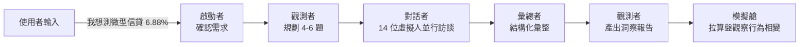
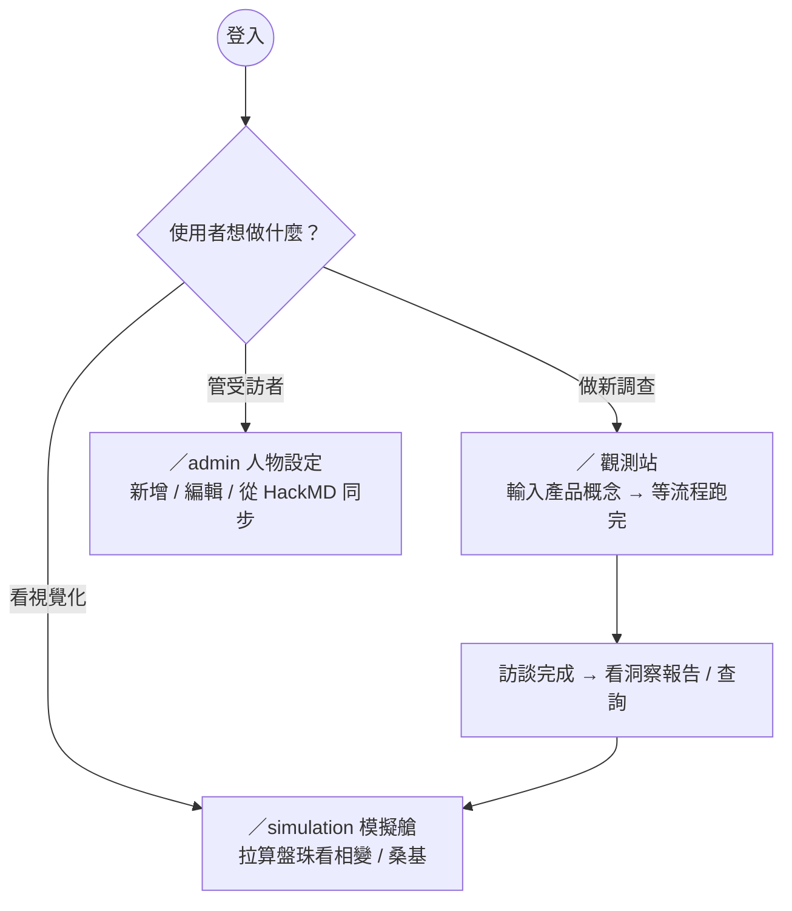
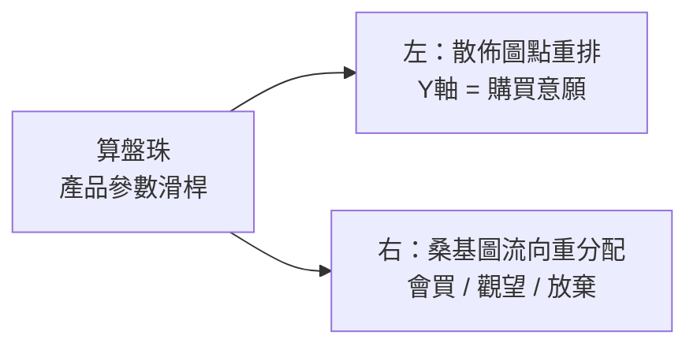
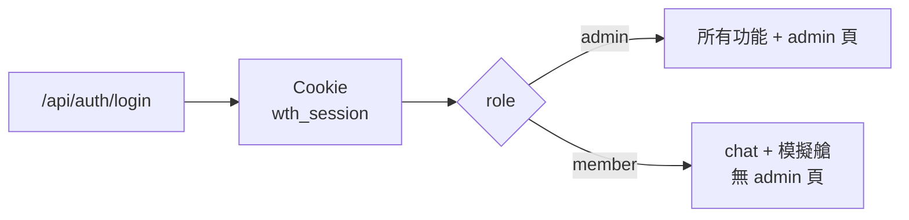
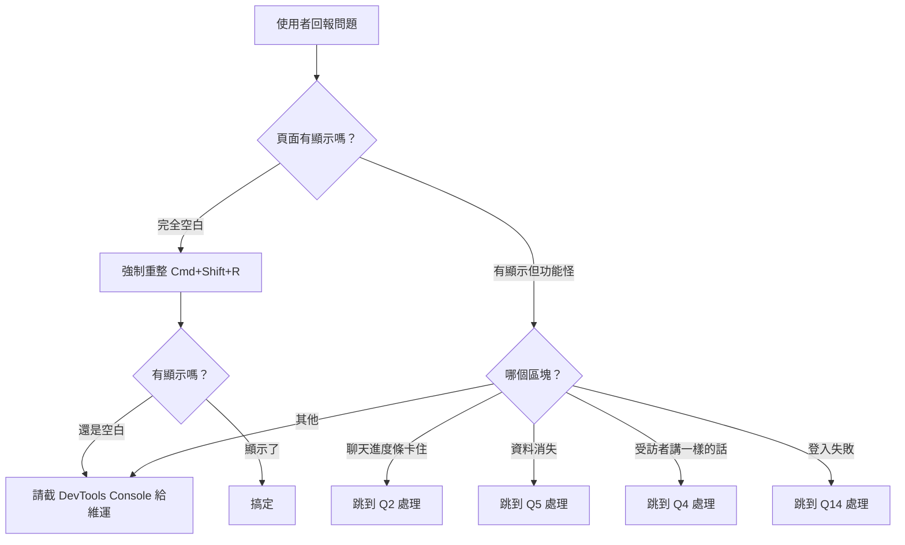

# 海森堡的算盤 · Q&A 支援手冊

> 給客服 / 內部支援人員的常見問題與回答。每節先有概念圖讓你快速 mental model，後面是面對使用者問題時的話術範本。

---

## 0. 5 分鐘 mental model

> 「使用者輸入想測的金融產品，系統用 LLM 模擬 14 位受訪者並行回答，產出散佈圖、桑基圖跟洞察報告。」



**重點直白版**

- 系統不打給真人 — 全部是 LLM 扮演的虛擬受訪者
- 「受訪者」資料在 `data/personas.json`，admin 介面可以加減 / 編輯
- 每跑一次訪談大概 30-60 秒，看人設數量
- 訪談完成後可以回頭「查詢」（不重跑流程，問已收集到的答案）

---

## 1. 三條主要使用路徑



---

## 2. FAQ — 一般問題

### Q1. 「我輸入問題後，啟動者一直回我『需要更多資訊』，怎麼辦？」

**情境**：使用者只說「幫我做市場調查」這種沒主題的話。

**回應**：
> 啟動者需要至少其中一項：(1) 想測的產品 (2) 想了解的問題 (3) 目標客群。請補一句具體的，例如「我想測一張外送員聯名信用卡，想知道辦卡意願」就會直接進下一棒。

### Q2. 「為什麼跑到一半畫面卡住沒進展？」

最常見三種原因：

| 症狀 | 可能原因 | 處理 |
|---|---|---|
| 進度條卡在「對話者」很久 | 14 位 persona 並行打 LLM，網路慢時要 30-60 秒 | 等。超過 90 秒沒動 → 重新整理重試 |
| 進度條閃一下就消失 | 後端 `MINIMAX_API_KEY` 沒設或過期 | 維運檢查 `.env.local` |
| 完全沒反應、loading 也不動 | Cookie session 過期 | 登出再登入 |

### Q3. 「進度條顯示『等待輸入 — 流程待命中』但我訊息還在？」

**已修復** (commit `73dcbf7` 之後)。如果還看到，請使用者：
1. 登出再登入
2. 開瀏覽器 DevTools → Application → Local Storage → 清掉 `wth.persona-session.v3`

### Q4. 「為什麼兩位虛擬受訪者講一樣的話？」

如果出現在「受訪者顯影」的 SpectrumSwitcher 區塊：
- **舊版** (commit 前) — 自訂受訪者掉到 fallback，三個產品類型只有三句話。
- **新版** — 已改成依 persona 屬性動態生成（年齡 / 收入 / 撫養 / 信用 / 個性）。

如果新版還看到一樣的話：兩人屬性高度相似（同年齡層 + 同收入層 + 同撫養狀態），是預期行為。可以建議使用者去 `/admin` 微調人設讓區別更鮮明。

### Q5. 「我跑完訪談切到模擬艙，回來訊息不見了？」

**已修復** (持久化邏輯在 `PersonaSessionContext`)。如果還看到：
- 確認瀏覽器沒禁 localStorage（隱私模式下可能會）
- DevTools → Application → Local Storage → 看有沒有 `wth.persona-session.v3` 這個 key

### Q6. 「我可以邊聊邊改受訪者嗎？」

可以，但**改了不會回頭重跑** — 已生成的訊息是當下那批受訪者的答案。改完後要看新結果就點「↻ 重啟」開新一輪訪談。

### Q7. 「為什麼產品類型 toggle 不見了？」

設計簡化：產品類型現在由你在問題裡寫的關鍵字自動偵測（含「保險 / 信用卡 / 信貸 / 利率 / 回饋」等字），同時間只評估一種產品。要切換 → 直接重啟，輸入新產品。

### Q8. 「模擬艙底部的『算盤珠』在做什麼？」



- 信貸時拉的是「年利率%」
- 保險時拉的是「月費 元/月」
- 信用卡時拉的是「主要回饋率%」

拉動時，14 個粒子根據各自的特性即時重新計算「這個價碼下會不會買」，視覺化成散佈圖位置變化 + 桑基圖流向變化。

### Q9. 「客戶說資料有變動風險嗎？」

- LLM 回應每次都會略有不同（temperature 設定 + LLM 內生隨機性），這是設計的
- 同一個 persona 的「分數」（經濟壓力 / 借貸需求 / 信用狀態 …）由 [`lib/persona-scores.ts`](../lib/persona-scores.ts) 純啟發式計算 — 改 persona 文字才會變
- 桑基 / 散佈用的是分數計算，**不依賴 LLM 答案** — 可以重現

### Q10. 「我可以匯出報告嗎？」

目前報告卡（ReportCard）和洞察卡（SummaryCard）會渲染在頁面上，截圖即可。要 PDF / 純文字匯出尚未實作 — 列在 backlog。

---

## 3. FAQ — 受訪者管理（admin 頁）

### Q11. 「HackMD 同步是什麼？」

`/admin` 右上角有「從 HackMD 拉」按鈕。系統會去抓專案 HackMD 文件的「人設設定」章節，解析後覆蓋 `data/personas.json`。**會清掉本地手改的內容**，提醒使用者先匯出備份。

### Q12. 「我可以用 LLM 生成新人設嗎？」

可以，admin 頁有「LLM 生成」按鈕。輸入 archetype（如「保守型退休教師」）即可。生成後會 append 到清單（不覆蓋）。

### Q13. 「人設刪掉會影響舊報告嗎？」

不會。報告是一次性的快照（存在 `messages` 裡），跟 `personas.json` 解耦。但下一輪訪談會用新清單。

---

## 4. FAQ — 帳號與權限



### Q14. 「我登入不進去」

- 帳密寫在伺服器 `AUTH_USERS` 環境變數，使用者改不到。請維運檢查格式（見下）。
- 格式範例：
  ```json
  AUTH_USERS=[{"account":"udo","name":"管理員","role":"admin","password":"xxx"}]
  ```

### Q15. 「我是 member 為什麼看不到 admin 頁？」

設計如此。member 只能用 chat / 模擬艙，admin 頁靠 role check 擋下。要升級權限請聯繫專案管理員改環境變數。

---

## 5. 故障排除流程圖



---

## 6. 關鍵字快速索引

| 使用者用詞 | 真正在指 | 對應章節 |
|---|---|---|
| 「機器人」 / 「AI」 / 「人工智慧」 | LLM agent | §0 mental model |
| 「假人」 / 「虛擬人」 | persona / 受訪者 | §0、Q4 |
| 「卡住」 / 「轉圈」 | streaming pipeline 進行中或失敗 | Q2 |
| 「算盤」 | AbacusBar | Q8 |
| 「散佈圖」 / 「點點圖」 | PhaseTransitionMap | §0 |
| 「流程圖」 / 「水流圖」 | DecisionSankey | Q8 |
| 「報告」 / 「洞察」 | ReportCard / SummaryCard | Q10 |
| 「後台」 / 「設定」 | /admin 人物設定頁 | §3 |

---

## 7. 升級與已知限制

**已知限制（請主動告知使用者）**

- 一次只能評估一種產品（信貸 / 保險 / 信用卡 三選一），需切換請重啟
- 受訪者最多建議 ≤ 30 位，超過會超時或被 rate limit
- 客觀問題（「他會不會買 X」）回答品質高；主觀問題（「他比較喜歡 A 還是 B」）穩定度較低
- 訪談結果非真實人類意見，不可作為法規 / 合規依據

**Backlog（暫不實作但常被問）**

- 匯出 PDF / Excel
- 多語言（目前繁中）
- 訪談錄音 replay
- 自訂評分權重 / 算盤公式

---

_有 Q&A 沒涵蓋的問題，請先到 `docs/architecture.md` 找對應元件，再問維運。_
