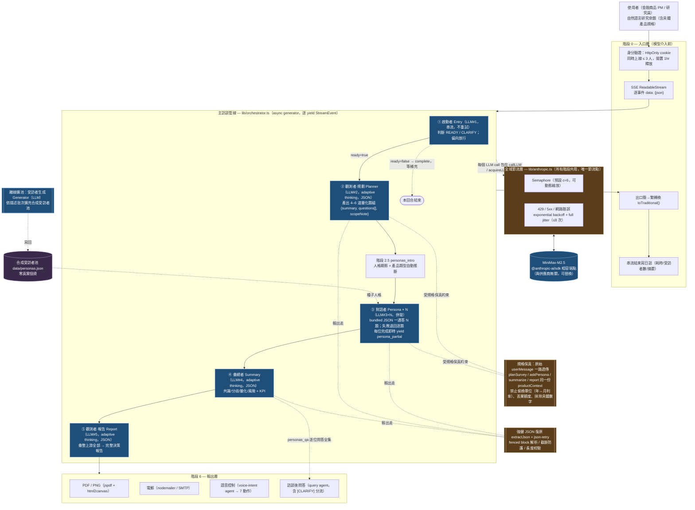
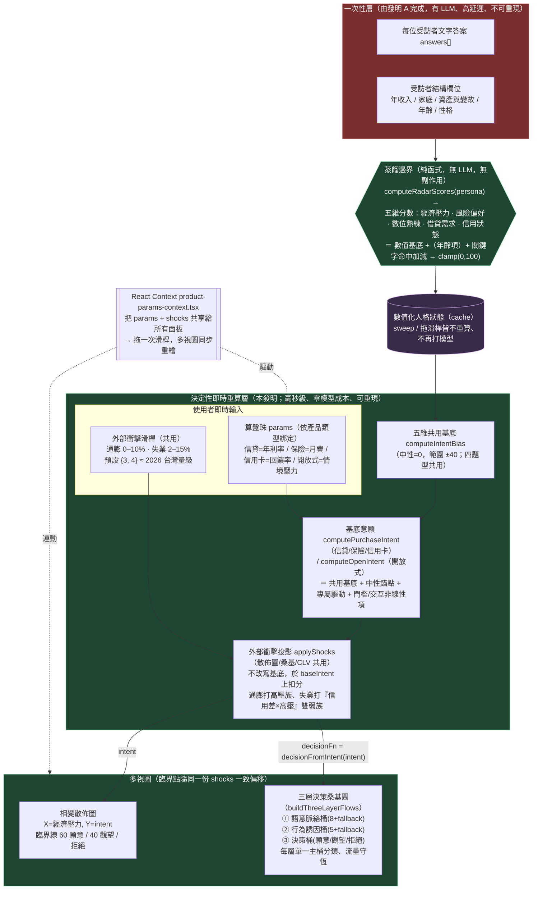

# 兩件專利之系統架構圖

> 對應兩份技術揭露書，各一張可獨立成立（standalone）的系統架構圖，供專利代理人擬圖式（drawings）參考。
> 兩圖以 Mermaid 撰寫，GitHub / VSCode preview 直接渲染；要出 PNG 可用 `npm run diagrams` 的同款 `@mermaid-js/mermaid-cli`。
>
> - **發明 A — 基於虛擬數位分身之自動化市場調查系統及方法**（[invention-A-pipeline.html](invention-A-pipeline.html)）
> - **發明 B — 互動式決策模擬與外部衝擊預測之解耦架構**（[invention-B-simulation.html](invention-B-simulation.html)）
>
> 兩件發明的分界即「蒸餾邊界」：A 產出每位虛擬數位分身的文字答案與結構欄位，B 把它蒸餾為數值化人格狀態後做決定性即時重算。整合全景見 [../architecture.md §1.5](../architecture.md)。

---

## 發明 A — 自動化市場調查管線（端到端資料流）

**主張標的**：把市場調查拆解為「啟動判斷 → 量化規劃 → 平行合成訪談 → 證據彙總 → 決策報告」五道由不同 system prompt 約束的代理人階段；階段間以原始產品規格上下文（productContext）串接以避免數字失真；並以單通捆綁式 JSON、全域併發節流、強健 JSON 復原等機制，使「多受訪者 × 多題」的大量模型呼叫在個人級速率限制下仍能可靠完成。

**圖中三個可專利機制（以暖色標出）**：

| 機制 | 解決的問題 | 實作 |
|---|---|---|
| 全域併發節流 + 退避 | 個人級 rate limit 下，30 受訪者並行不踩爆 429 | `lib/anthropic.ts` Semaphore + jitter backoff |
| 規格保真上下文串接 | 中間摘要造成數字 / 單位失真 | 原始 `userMessage` 透傳四個階段 |
| 單通捆綁 JSON + 強健復原 | 150 通呼叫的瓶頸；模型 JSON 不穩 | bundled `{answers[]}` + `extractJson` + 逐題 fallback |

---

## 發明 B — 互動式決策模擬與外部衝擊預測（訪談 / 模擬解耦）

**主張標的**：把不可重現、高延遲的 LLM 訪談文字，一次性蒸餾為可被決定性方程式即時重算的數值化人格狀態，使下游所有 what-if 參數探索得以「零邊際模型成本、完全可重現、即時連動多視圖」進行，並以共用的外部衝擊投影函式使所有面板的臨界點一致地偏移。

**圖的閱讀重點**：

- **紅色 = 有 LLM（只跑一次）**，**綠色 = 純函式（每次拖滑桿重跑）**。可專利核心就是把這兩種成本特性用「蒸餾邊界」一刀切開。
- **共用基底 `computeIntentBias`**：四種題型（信貸/保險/信用卡/開放式）先取同一份五維偏移，再各自疊中性錨點與專屬驅動 → 任一題型（含無金融關鍵字的開放式）都以完整五維人格計算。
- **共用衝擊投影 `applyShocks`**：散佈圖、桑基圖、CLV 套同一個函式，所以同一份 `{通膨, 失業}` 設定下，所有視圖的臨界點**一致偏移**——這是「多視圖即時連動」主張的技術根據。
- **純函式 + cache + clamp(0,100)**：加性可分解、無副作用、輸出夾限 → sweep 成本低、重現性 100%、視覺穩定。

> 性質聲明：B 的意願 / 衝擊方程式為 **heuristic 行為模型**（數量級對、單調性對、相對排序對），供決策者看 trade-off 形狀與相變臨界點，非精算數字。專利標的為「建構方法論 + 即時重算架構」，非任何特定係數之精確值。

---

## 兩圖如何銜接（一句話）

發明 A 圖右下角的「合成受訪者池 + 每位文字答案」＝發明 B 圖左上角的「一次性層」輸入；中間那道 `computeRadarScores` 蒸餾邊界，就是兩件專利的法律與技術分水嶺。
